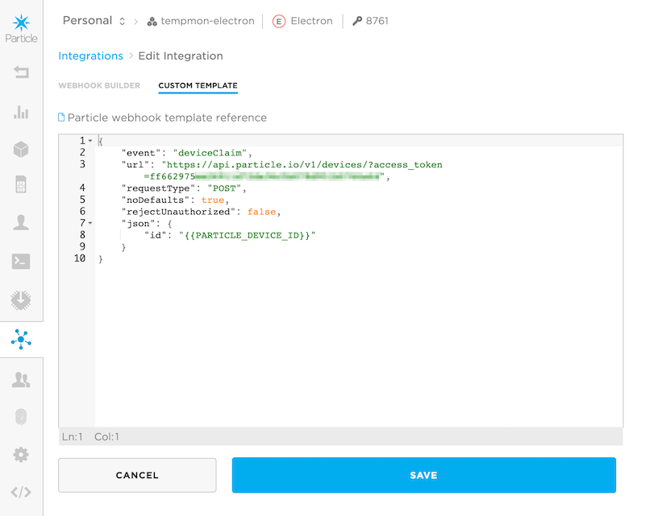

# DeviceClaimRK

*Particle firmware library to help with device claiming*

Particle devices must be claimed to an account, and claiming can only be done when the device is online (breathing cyan). For cellular products, it's common to claim all devices to a single account owned by the product creator. It is possible to use two-legged shadow customers for claiming, however this makes setup much more complicated.

If using a single owning account, the claiming is typically done when the device is set up with firmware and tested. However, in some cases this is not practical or even possible. For example, claiming a Europe/Asia/Africa Electron (U270) while in the United States is impossible. A similar situation can occur with LTE Cat M1 devices.

It is possible to claim a product device when it first connects to the cloud. There are a two main ways this can be done:

- One option is to have your own server that monitors online events and checks to see if the device has been claimed yet, and if not, claims the device.
- The technique described here is interesting because it only requires two webhooks and no server. The downside of this technique is that it requires some code in your device firmware.

**We really do recommend claiming your devices ahead of time**, but if for some reason this is not possible, this method is worth looking into.

## How it works

There are a few important assumptions:

- You have a product in the Products tab in the [console](https://console.particle.io).
- All devices will be claimed to a single account.
- Your device firmware uses `SYSTEM_THREAD(ENABLED)`.
- You have 8 bytes of available space in the virtual EEPROM (2047 bytes on Photon/P1/Electron, and 4096 bytes on Gen 3).

Then, on the cloud side:

- You have generated a non-expiring access token for the user account that will claim all of your devices.
- You have set up the two necessary webhooks, **deviceClaim** and **deviceTest**, in your product (you can customize the names).
- Make sure you've added your device IDs to your product.

On the device side:

- Device firmware includes the **DeviceClaimRK** library, initialize any settings, and calls the `setup()` and `loop()` methods.

- When the device starts up, in `setup()` the EEPROM is checked. If the claimed flag is set, nothing more is done.

- If the EEPROM has not been initialized or has other random data in it (there are magic bytes in the saved data), the an attempt will be made to claim.

- After successfully connecting to the cloud (breathing cyan), the **deviceClaim** event is sent.

- The **deviceClaim** webhook uses the device claim API to claim the device to the single account.

- After a few seconds, the device will disconnect from the Particle cloud. This is necessary to make the change take effect.

- Upon reconnecting to the cloud, the **deviceTest** event is published.

- The **deviceTest** webhook will attempt to retrieve device information and return it in the hook-response.

- If the device receives the hook-response then the claiming worked. The claimed flag is set in EEPROM and no attempts will be made to claim in the future.

And some other trivia:

- If the hook-response is not received, then the claiming failed. The device will stay in the failed state. On next restart it will try claiming again.

- If the EEPROM is cleared an attempt will be made to claim again, and if already claimed to the same account, the process still succeeds.

- All of the timing parameters can be adjusted.

- All event names are programmable.

- There are no sensitive things like access tokens in the device firmware. They're only in the webhooks.

- Make sure you add the device IDs to your account and don't use auto-approve. Otherwise, anyone could claim any device to your account, which is probably not what you want.

- If you want to store the configuration somewhere else (your own EEPROM, flash, SD card, FRAM, etc.) you can do so by subclassing the DeviceClaim class.

## Webhook

### Access Token

In order to use the webhook, you need to embed an access token for the account that will claim all of the devices. This account must also be a product team member.

The easiest way is to use the Particle CLI:

```
particle token create --never-expires
```

Do not attempt to use the token from the Web IDE (build.particle.io) as that token does not have product permissions and will not work.

### Device Claim Webhook

The device claim webhook looks like this:

```
{
    "event": "deviceClaim",
    "url": "https://api.particle.io/v1/devices/?access_token=ff662975ee26911d72da36c5b078d951b0766a63",
    "requestType": "POST",
    "noDefaults": true,
    "rejectUnauthorized": true,
    "json": {
        "id": "{{PARTICLE_DEVICE_ID}}"
    }
}
```

The easiest way to do this is to create a webhook and go into the **Custom JSON** view and paste this in. Be sure to replace ff662975ee26911d72da36c5b078d951b0766a63 with a valid access token (that is not a valid access token). The other parameters are the same.



You can change the eventName, but must do so both in the webhook and in the device firmware using the withClaimEventName() method.

### Device Test Webhook

The device test webhook looks like this:

```
{
    "event": "deviceTest",
    "url": "https://api.particle.io/v1/devices/{{PARTICLE_DEVICE_ID}}?access_token=ff662975ee26911d72da36c5b078d951b0766a63",
    "requestType": "GET",
    "noDefaults": true,
    "rejectUnauthorized": true,
    "responseTopic": "{{PARTICLE_DEVICE_ID}}/hook-response/{{PARTICLE_EVENT_NAME}}"
}
```

This webhook returns information about the device after attempting claiming. If the claim did not succeed, the device will
not receive this information and it will know that claiming failed.

Don't forget to update the access token.

## Device Firmware

### Adding DeviceClaim to your code

Adding the library to your device firmware is easy:

```
#include "DeviceClaimRK.h"

PRODUCT_ID(8761);
PRODUCT_VERSION(1);

SYSTEM_THREAD(ENABLED);

SerialLogHandler logHandler;

DeviceClaim deviceClaim;

void setup() {
    deviceClaim.withEepromAddr(1990);
    deviceClaim.setup();
}

void loop() {
    deviceClaim.loop();
}

```


